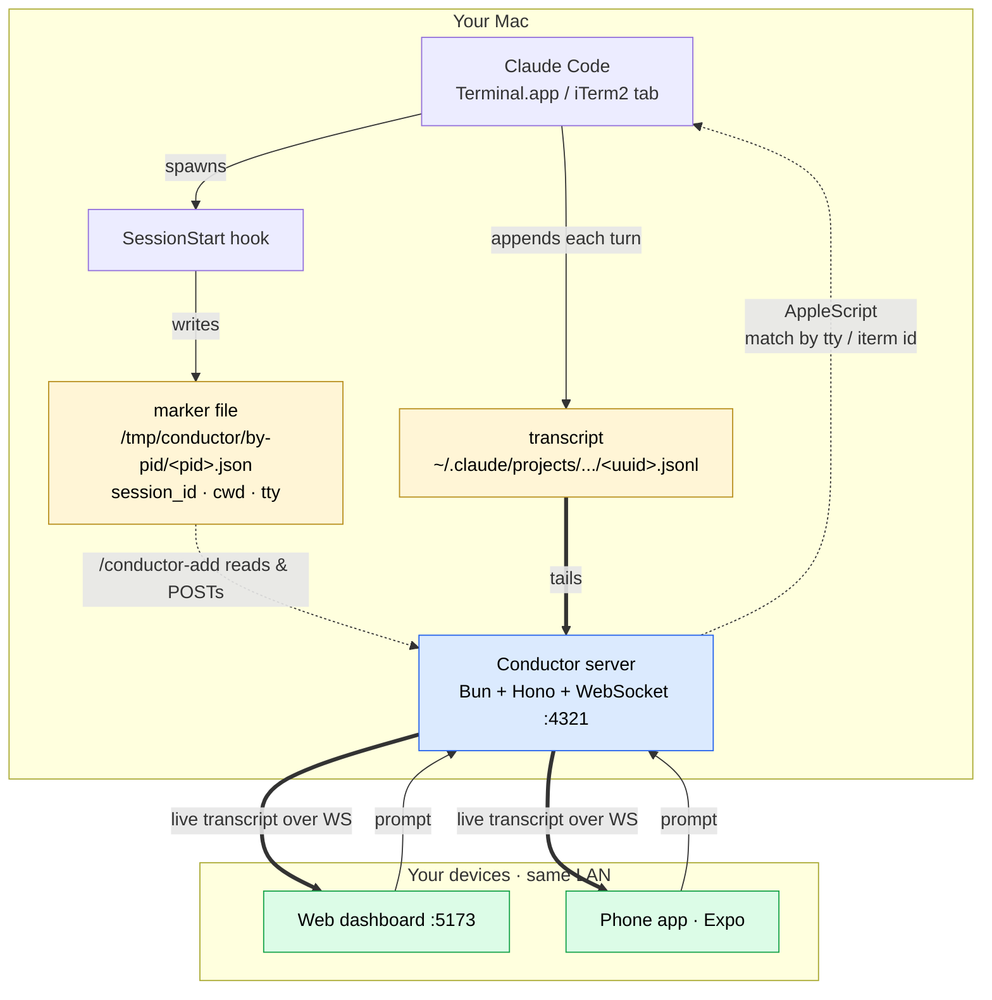
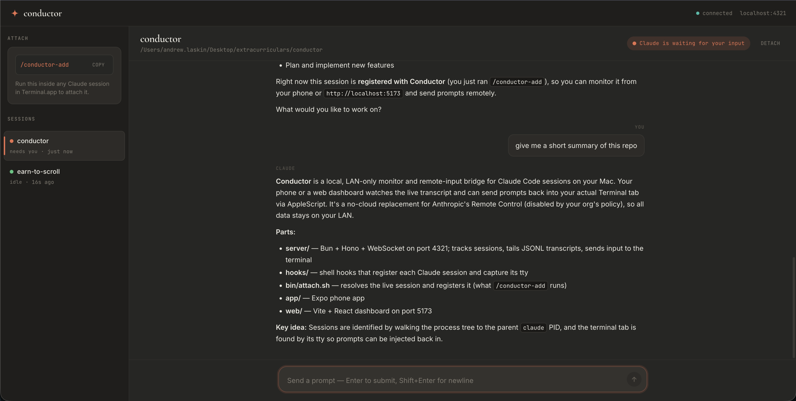

# Conductor

### ME CALL IT "KONDUKTOR"

> phone watches claude. mac does work. no cloud.

A LAN only monitor and remote input bridge for Claude Code sessions running on
your Mac. Your phone (or a web dashboard) watches the live transcript and can
send prompts back into the actual Terminal.app / iTerm2 tab via AppleScript.
Nothing ever leaves your local network.

## Why

Anthropic shipped an official feature called
[Remote Control](https://code.claude.com/docs/en/remote-control) (Feb 2026)
that does almost exactly this, but it routes chat messages and tool results
through the Anthropic API. Plenty of orgs disable it by policy, so you see:

```
Remote Control is disabled by your organization's policy
```

Conductor is the no cloud equivalent. Same idea, different wire: every byte
stays on your LAN.

### vs Remote Control

| feature                  | Remote Control | Conductor |
| ------------------------ | -------------- | --------- |
| wire                     | Anthropic API  | your LAN  |
| works under a policy block | blocked      | fine      |
| multiple sessions        | yes            | yes       |
| viewers per session      | 1              | many      |
| web + mobile             | yes            | yes       |

## What it does

Your Mac runs Claude Code in any Terminal.app or iTerm2 tab. The transcript
streams to your phone and to a web dashboard at `localhost:5173` over
WebSocket. From either one you can type a prompt and it lands in the correct
Terminal tab as if you typed it yourself. Open as many Claude sessions in as
many tabs as you want; each shows up separately, with full history replayed.

## Architecture



## Install

```bash
git clone <repo> conductor
cd conductor
bash hooks/install.sh
./start.sh
```

Open http://localhost:5173 for the dashboard. Scan the Expo QR for the phone
app, then paste the LAN URL the server prints into Settings.

## Daily use

Run `claude` in any Terminal.app or iTerm2 tab. Inside it, type
`/conductor-add`. The session appears in the web dashboard and phone app
immediately, full transcript replayed. Status tracks live (thinking / idle /
needs input), and you can send prompts from either device.

## How it works

1. The **SessionStart hook** walks the process tree to find the parent
   `claude` PID and drops a marker at `/tmp/conductor/by-pid/<pid>.json`
   containing `{ session_id, cwd, tty, iterm_session_id }`.
2. You type `/conductor-add`. The slash command runs `attach.sh`, which walks
   up the same process tree, reads the exact marker for *its* Claude, and
   POSTs it to the local server at `:4321`.
3. The server **tails** `~/.claude/projects/<encoded-cwd>/<uuid>.jsonl` and
   pushes each turn over WebSocket to every connected client (phone + web).
4. To send a prompt back, the server uses **AppleScript**. iTerm2 sessions
   match by `unique id`; Terminal.app tabs match by `tty`. Either way Claude
   sees it as if you typed it.

## Two ways to run it

### LAN mode (default)

No flags, no setup. Phone and Mac on the same Wi-Fi. Nothing ever leaves your
house, not even the connect handshake. Perfect for working from home.

### Anywhere mode (with Tailscale)

```bash
./start.sh --anywhere
```

Pipes everything through your [Tailscale](https://tailscale.com) tailnet so
private IPs follow your devices. Phone on cellular at a coffee shop still talks
to your Mac at home. Still no third party cloud touches your data; Tailscale
just gives your devices private IPs.

**Setup (once):**

1. Install Tailscale on your Mac (`brew install --cask tailscale` or the Mac
   App Store build) and on your phone. Sign in with the same account.
2. Confirm:
   ```bash
   tailscale status        # logged in
   tailscale ip -4         # prints 100.x.y.z
   ```

**What the flag does:**

- Looks up your Mac's tailnet IP and bails with a clear error if Tailscale
  isn't installed or up.
- Sets `EXPO_PACKAGER_HOSTNAME` to that IP, so the Expo QR encodes the tailnet
  IP instead of the LAN one. The bundle loads on cellular.
- Prints the tailnet URLs in the banner.

The server already binds `0.0.0.0`, and the web dashboard derives its host
from `window.location.hostname`, so once everything is up:

- **Mac browser**: `http://localhost:5173` (loopback, doesn't touch Tailscale)
- **Phone / iPad / etc.**: `http://<tailnet-ip>:5173`
- **Phone Expo app**: set Settings → server URL to `http://<tailnet-ip>:4321`

The same URLs work on home Wi-Fi and on cellular. When your phone switches
networks, the WebSocket drops and auto reconnects in ~2 seconds, then the
transcript resumes. No restart, no config swap.

## Stack

- **Server**: Bun + Hono + native WebSocket, port 4321. Tracks sessions, tails
  JSONL transcripts, sends input to the terminal.
- **Web**: Vite + React + TypeScript, port 5173. Plain CSS, no UI framework.
- **Phone**: Expo SDK 54, expo-router, zustand.
- **Hooks**: one bash script wired to SessionStart / Notification / Stop /
  UserPromptSubmit.
- **Input bridge**: AppleScript via `osascript`.

## Screenshots

**Web dashboard:**



## Hairy details (worth knowing if you go reading the source)

- **encodeCwd**: every character that isn't a letter or digit becomes `-` (so
  `jane.doe` → `jane-doe`). Don't shortcut this to just `/` → `-`.
- **Status state machine** is driven by hooks, never by the JSONL tailer.
  Setting status from `onMessage` races with the Stop hook and sessions get
  stuck in `thinking` forever.
- **Session keying** uses two maps: `sessions: Map<id, Session>` for UI
  routing, and `byClaudeSid: Map<claudeSessionId, id>` for hook lookups.
- **Marker files** at `/tmp/conductor/by-pid/<pid>.json` persist after Claude
  exits. PID reuse is technically possible (fine in practice), but worth a
  staleness check if it ever bites.
- **Phone → terminal**: Terminal.app tabs don't have stable per tab UUIDs like
  iTerm2, so we match by `tty` (e.g. `/dev/ttys003`). Multi-line prompts go
  through a clipboard + Cmd+V paste so the newlines survive as one input, which
  briefly steals focus and needs Accessibility permission for the osascript
  runner.

## Limitations

- Phone needs the same Wi-Fi by default. Use `./start.sh --anywhere` +
  Tailscale to break that.
- Sending only works in Terminal.app and iTerm2. Inside tmux, VS Code's
  integrated terminal, or screen, the transcript still streams but the
  composer is disabled.
- No background push notifications. The web dashboard / phone app is the
  signal, so keep one open.

## Future / nice to have (to appease the AI overlords)

One Claude session as the master. Build a small MCP server that wraps
Conductor's REST endpoints as tools (`list_sessions`, `send_to_session`,
`read_session`), register it in one Claude session, and that session can
dispatch work to every other Claude session by name or cwd. You say "fix the
cron bug in the backend repo" and it routes to the right worker on its own.

## License

MIT.

---

## ME CALL IT KONDUKTOR (caveman)

konduktor watch claude from phone or browser. nothing leave home network.

anthropic make remote control. work good but talk go through anthropic. some
boss say no. konduktor same idea, different wire. phone watch. mac do work.
no cloud.

run claude in terminal or iterm like always. claude start, hook find claude
pid, grab tty and iterm uuid, drop marker in `/tmp/conductor/by-pid/<pid>.json`.

type `/conductor-add`. script read marker, tell server "this one live".
server watch jsonl, push to phone and web over websocket.

phone send prompt? server use applescript. iterm tab? use iterm uuid.
terminal tab? use tty. claude read like you type with finger.

bun and hono for server. vite for web. expo for phone. one bash for hook.
applescript for input. no database. no cloud. no spy.

leave house? `./start.sh --anywhere`. tailscale carry mac in pocket.
phone still talk to mac. still no cloud. still no spy.

big rocks: mit. take freely. dont break friend tool.
